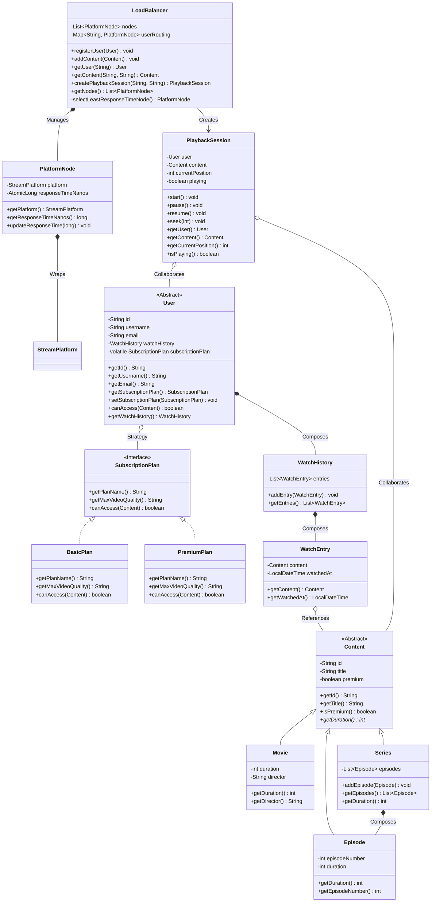

# StreamCore: High-Throughput Video Streaming Domain Architecture

StreamCore is an ultra-high performance, thread-safe Core Java implementation of a Video Streaming Platform Domain Architecture. It is engineered as a clean-room reference architecture to showcase advanced Object-Oriented Programming (OOP), Low-Level Design (LLD), concurrency safety, and cluster load-balancing scheduling without relying on any third-party frameworks or databases.

---

## System Architecture & Low Level Design

The following diagram maps the structural inheritance, strategy composition, and concurrent collaborations of the StreamCore components:



---

## Technical Implementations

* **Concurrency & Safety**:
  - `StreamPlatform` stores catalogs and users inside `ConcurrentHashMap` for lock-free parallel lookups.
  - `WatchHistory` uses `CopyOnWriteArrayList` to prevent `ConcurrentModificationException` during concurrent logging.
  - `User` declares its `SubscriptionPlan` as `volatile` to guarantee immediate visibility of plan updates across threads.
* **Least Response Time Algorithm**:
  - `LoadBalancer` tracks node execution metrics in nanoseconds.
  - Uses an Exponential Moving Average (EMA) to smooth node selection rules:
    $$ \mathcal{EMA}_t = (\mathcal{EMA}_{t-1} \times 0.9) + (\mathcal{L}_{current} \times 0.1) $$
  - Maps users to the fastest registered server node via a thread-safe routing registry.
* **Domain Design & Decoupling**:
  - **Strategy Pattern**: Decouples content access validation checks from `User` subtypes using the `SubscriptionPlan` interface.
  - **Composition Over Inheritance**: `Series` composes `Episode`s and computes total duration dynamically.
  - **Factories**: Object creation is encapsulated in `ContentFactory` and `UserFactory` instances.
* **SOLID Compliance**:
  - *Single Responsibility*: Separated data state, access checks, playback control, and load balance nodes.
  - *Open/Closed*: Easy to extend plans or content types without modifying core balancer or platform logic.
  - *Dependency Inversion*: Client code depends on factories and abstractions, not concrete subclasses.
* **Defensive Integrity**:
  - Collections are encapsulated using `Collections.unmodifiableList()` or `Collections.unmodifiableCollection()`.
  - Fail-fast check on constructor parameters and playback initialization.

---

## Core Technology Stack & Prerequisites

* **Development Language**: Java SDK 17 or higher.
* **Build System**: Apache Maven 3.6.0+.
* **Testing Library**: JUnit 5 (Jupiter).

---

## Installation & Setup Guide

### 1. Clone the Repository
```bash
git clone https://github.com/Shabbir5152/stream-core.git
cd stream-core
```

### 2. Compile and Build
```bash
mvn clean compile
```

### 3. Run the Unit Test Suite
Execute the verification unit tests:
```bash
mvn clean test
```

### 4. Execute Concurrency and Load Balancer Simulation
Run the simulation task processing for high volume concurrent access.
```bash
mvn exec:java
```

Testing statistics with 50,000 dynamic requests using 16 concurrent threads across 5 cluster nodes is as follows:
```text
--- Multithreaded Load Balancer Simulation ---
  Total Requests Processed: 50000
  Access Granted Sessions : 40682
  Access Denied Sessions  : 9318
  Errors / Misses         : 0
  Total Execution Time    : 192 ms
  Platform Throughput     : 260416.67 req/sec

--- Load Balancer Cluster Diagnostics ---
  Node #1 | Response Time Metric: 215 ns 
  Node #2 | Response Time Metric: 166 ns 
  Node #3 | Response Time Metric: 182 ns 
  Node #4 | Response Time Metric: 153 ns 
  Node #5 | Response Time Metric: 183 ns 

  Total Watch History Entries Across Cluster: 40682
```

---

## Contributing

We welcome contributions to StreamCore. To contribute:
1. **Fork** the repository on GitHub.
2. Create a new feature **branch** (`git checkout -b feature/amazing-feature`).
3. Maintain **thread-safety** and **clean code** standards.
4. Add JUnit 5 unit tests for any new validations or features.
5. Commit your changes and open a **Pull Request** to the `main` branch.

---

## License

This project is licensed under the MIT License - see the [LICENSE](LICENSE) file for details.
